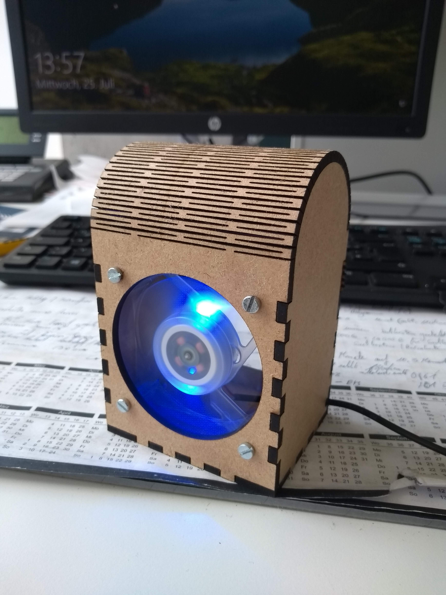

# Fume-Extractor
Lasercut Gehäuse für einen einfachen Lötrauchabsauger mit einem 60mm USB-Lüfter

Das Gehäuse aus 3mm MDF lasercutten. Die Vorlage ist für einen 60mm 5V-Lüfter ausgelegt. Für Stromversorgung ein dünnes USB-Kabel am Lüfter anlöten und durch die Aussparung auf der linken Seite führen.
Den Deckel nicht verleimen sonder einfach nur "einhängen", so kann eine Aktivkohlefilter Matte in die Aussparung auf der Rückseite eingelegt werden und ggf. getauscht werden.

Dieser Lötrauchabsauger wurde vom [Fumetractor](https://www.kickstarter.com/projects/ehajo/fumetractor-a-smart-solder-fume-extractor?lang=de) inspiriert und ich hab für das entwerfen des Gehäuses bis zum fertig zusammengebaten Gerät etwa 1 Std. gebraucht ¯\\_(ツ)_/¯

